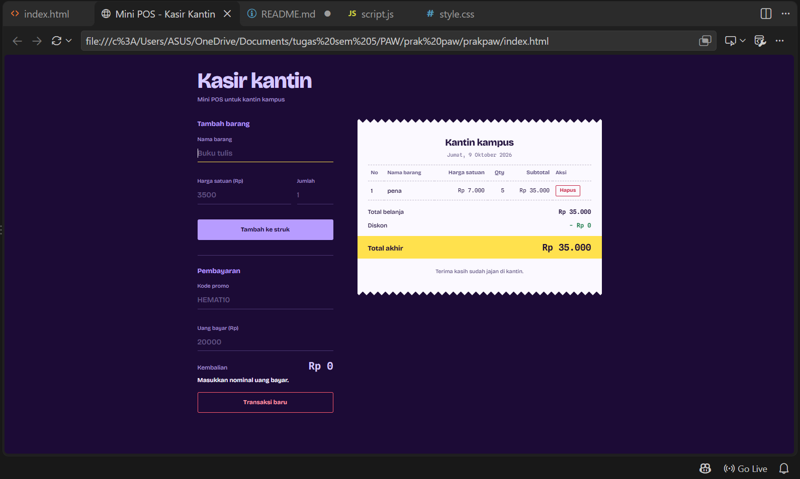
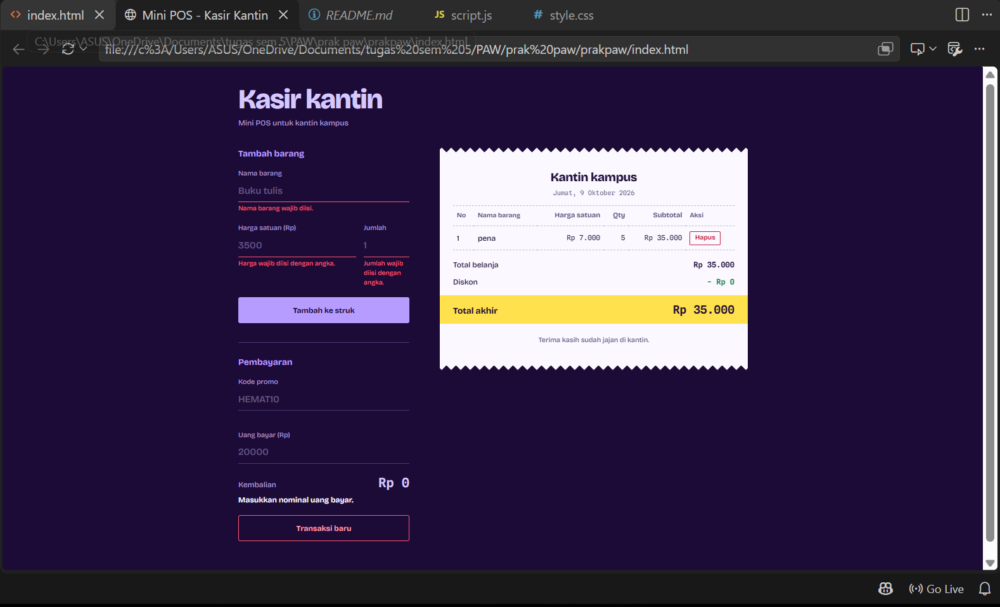
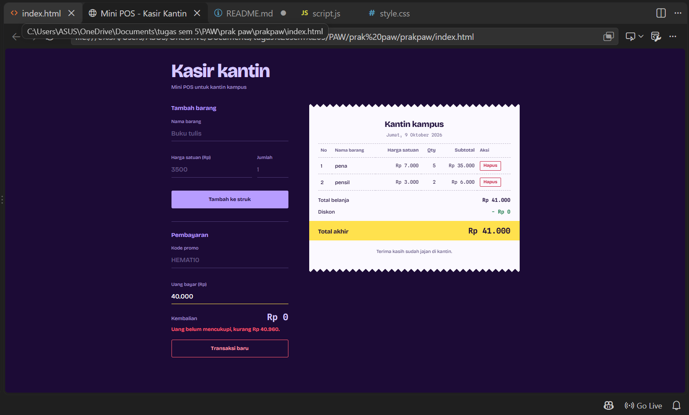
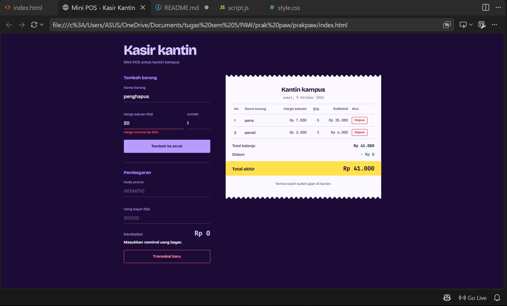
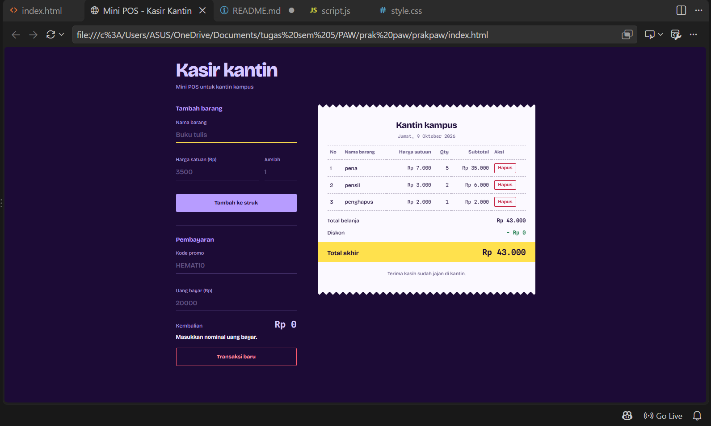

# Mini POS – Kasir Kantin

## Identitas

- Nama Lengkap: Annisa Afrida
- NIM: 124140121
- Kelas Praktikum: Pengembangan Aplikasi Website RA

## Deskripsi Aplikasi

Aplikasi kasir berbasis web yang dirancang untuk kantin kampus. Kasir dapat memasukkan barang yang dibeli, kemudian sistem akan menghitung subtotal, total pembayaran, diskon, dan uang kembalian secara otomatis. Data keranjang belanja disimpan menggunakan localStorage, sehingga tetap tersimpan meskipun halaman di-refresh.

## Panduan Menjalankan

1. Clone repository ini.
2. Buka folder proyek di VS Code.
3. Klik kanan `index.html` → Open with Live Server.

## Daftar Fitur

- [V] Memvalidasi nama barang minimal 3 karakter, harga minimal Rp500, dan jumlah barang berupa bilangan bulat minimal 1.
- [V] Menampilkan pesan kesalahan di bawah kolom input serta mengosongkan formulir setelah data berhasil ditambahkan.
- [V] Menghitung subtotal setiap barang dan total belanja secara otomatis.
- [V] Memberikan diskon sebesar 10% jika total belanja mencapai Rp50.000 atau menggunakan kode promo HEMAT10.
- [V] Menghitung total uang yang dibayarkan dan uang kembalian secara otomatis.
- [V] Menampilkan daftar barang dalam tabel keranjang yang dilengkapi tombol untuk menghapus barang.
- [V] Menyimpan data keranjang menggunakan localStorage dengan metode JSON.stringify dan JSON.parse.
- [V] Menyediakan tombol Transaksi Baru untuk memulai transaksi berikutnya.

## Tangkapan Layar

**Form input utama**

**Validasi error**

**Hasil perhitungan dan tabel keranjang**

## Penjelasan Teknis Singkat

- Validasi: Fungsi `validasiForm()` memeriksa tiga kolom input melalui `validasiNama()`, `validasiHarga()`, dan `validasiQty()` ketika formulir dikirim. Pesan kesalahan ditampilkan menggunakan `tampilkanError()`. Jika ditemukan input yang tidak sesuai, fungsi akan mengembalikan `false` sehingga barang tidak ditambahkan ke keranjang.

- Perhitungan: Fungsi `hitungSubtotal()` menghitung harga barang dikalikan jumlahnya, sedangkan `hitungTotalBelanja()` menjumlahkan seluruh subtotal menggunakan `reduce()`. Fungsi `hitungDiskon()` memberikan potongan 10% jika total belanja mencapai Rp50.000 atau kode HEMAT10 digunakan. Total pembayaran diperoleh dari total belanja dikurangi diskon, kemudian kembalian dihitung dari uang bayar dikurangi total pembayaran.

- Penyimpanan localStorage: Fungsi `simpanKeranjang()` menggunakan `JSON.stringify()` untuk menyimpan data keranjang setiap kali terjadi perubahan. Sementara itu, fungsi `muatKeranjang()` menggunakan `JSON.parse()` untuk mengambil kembali data yang tersimpan ketika halaman dibuka.
